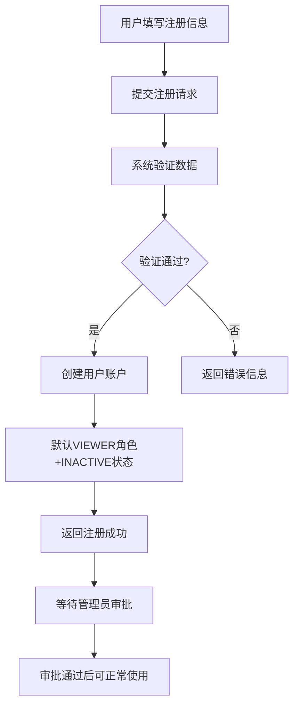

# 📝 用户注册 API 文档

## 📖 概述

用户注册API提供开放式的用户注册功能，允许未登录用户自主注册管理员账户。注册成功后，用户默认为 `VIEWER` 角色且处于 `INACTIVE` 状态，需要超级管理员审批后才能正常使用系统。

### 🎯 功能特点

- ✅ **开放注册**：无需登录即可注册
- ✅ **自动审批流程**：注册后进入待审批状态
- ✅ **安全控制**：默认最低权限，需管理员审批
- ✅ **数据验证**：完整的输入校验和错误提示
- ✅ **操作日志**：记录注册操作用于审计

### 🔄 注册流程



---

## 🔗 API 接口详情

### 基础信息

- **接口地址**: `POST /api/v1/admin/auth/register`
- **认证要求**: 无需登录
- **数据格式**: JSON
- **内容类型**: `application/json`

---

## 📝 用户注册

创建新的用户账户，注册后默认为待审批状态。

### 请求信息

```http
POST /api/v1/admin/auth/register
Content-Type: application/json
```

### 请求参数

| 参数名 | 类型 | 必填 | 长度限制 | 说明 |
|--------|------|------|----------|------|
| username | string | 是 | 3-50字符 | 用户名，必须唯一 |
| password | string | 是 | 6-50字符 | 密码，需符合强度要求 |
| real_name | string | 否 | 最大50字符 | 真实姓名 |
| email | string | 否 | 有效邮箱格式 | 邮箱地址，必须唯一 |
| role | string | 否 | - | 角色（注册时忽略，默认为viewer） |

### 密码强度要求

- ✅ 至少6个字符
- ✅ 包含至少1个字母（大写或小写）
- ✅ 包含至少1个数字

### 请求示例

```bash
curl -X POST "http://localhost:8001/api/v1/admin/auth/register" \
  -H "Content-Type: application/json" \
  -d '{
    "username": "zhangsan",
    "password": "abc123",
    "real_name": "张三",
    "email": "zhangsan@example.com"
  }'
```

### 响应格式

#### 成功响应 (200)

```json
{
  "success": true,
  "message": "注册成功，请等待管理员审批后才能正常使用",
  "data": {
    "admin_id": 123,
    "username": "zhangsan",
    "real_name": "张三",
    "email": "zhangsan@example.com",
    "role": "viewer",
    "status": "inactive",
    "created_at": "2025-10-21T11:30:00Z",
    "approval_required": true
  }
}
```

#### 响应字段说明

| 字段名 | 类型 | 说明 |
|--------|------|------|
| success | boolean | 操作是否成功 |
| message | string | 操作结果提示信息 |
| data.admin_id | integer | 新创建的用户ID |
| data.username | string | 用户名 |
| data.real_name | string | 真实姓名 |
| data.email | string | 邮箱地址 |
| data.role | string | 用户角色（默认为viewer） |
| data.status | string | 账户状态（默认为inactive） |
| data.created_at | string | 创建时间（ISO格式） |
| data.approval_required | boolean | 是否需要审批（总是为true） |

---

## ❌ 错误处理

### 常见错误码

| HTTP状态码 | 错误类型 | 说明 | 解决方案 |
|------------|----------|------|----------|
| 400 | BAD_REQUEST | 请求参数错误 | 检查参数格式和必填项 |
| 400 | USERNAME_EXISTS | 用户名已存在 | 更换用户名 |
| 400 | EMAIL_EXISTS | 邮箱已被使用 | 更换邮箱地址 |
| 400 | WEAK_PASSWORD | 密码强度不足 | 按要求设置强密码 |
| 403 | FORBIDDEN | 角色限制 | 不能创建超级管理员 |
| 500 | INTERNAL_ERROR | 服务器内部错误 | 联系技术支持 |

### 错误响应示例

#### 用户名已存在 (400)

```json
{
  "detail": "用户名已存在"
}
```

#### 邮箱已被使用 (400)

```json
{
  "detail": "邮箱已被使用"
}
```

#### 密码强度不足 (400)

```json
{
  "detail": "密码强度不足: 密码必须包含至少一个字母"
}
```

#### 不能创建超级管理员 (403)

```json
{
  "detail": "不能通过此接口创建超级管理员"
}
```

---

## 💻 前端集成示例

### JavaScript 原生实现

```javascript
class UserRegistration {
  constructor() {
    this.apiUrl = 'http://localhost:8001/api/v1/admin/auth/register';
  }
  
  async register(userData) {
    try {
      const response = await fetch(this.apiUrl, {
        method: 'POST',
        headers: {
          'Content-Type': 'application/json'
        },
        body: JSON.stringify(userData)
      });
      
      const result = await response.json();
      
      if (response.ok) {
        return {
          success: true,
          data: result
        };
      } else {
        return {
          success: false,
          error: result.detail || '注册失败'
        };
      }
    } catch (error) {
      return {
        success: false,
        error: '网络错误，请稍后重试'
      };
    }
  }
  
  validatePassword(password) {
    const requirements = [
      { test: password.length >= 6, message: '密码至少6个字符' },
      { test: /[a-zA-Z]/.test(password), message: '密码必须包含至少一个字母' },
      { test: /\d/.test(password), message: '密码必须包含至少一个数字' }
    ];
    
    const errors = requirements
      .filter(req => !req.test)
      .map(req => req.message);
    
    return {
      isValid: errors.length === 0,
      errors
    };
  }
}

// 使用示例
const registration = new UserRegistration();

async function handleRegister() {
  const userData = {
    username: document.getElementById('username').value,
    password: document.getElementById('password').value,
    real_name: document.getElementById('realName').value,
    email: document.getElementById('email').value
  };
  
  // 验证密码强度
  const passwordValidation = registration.validatePassword(userData.password);
  if (!passwordValidation.isValid) {
    alert('密码不符合要求：\n' + passwordValidation.errors.join('\n'));
    return;
  }
  
  // 提交注册
  const result = await registration.register(userData);
  
  if (result.success) {
    alert('注册成功！请等待管理员审批后才能登录。');
    // 跳转到登录页面或显示等待审批页面
    window.location.href = '/login';
  } else {
    alert('注册失败：' + result.error);
  }
}
```

### Vue.js 组件示例

```vue
<template>
  <div class="registration-form">
    <h2>用户注册</h2>
    
    <form @submit.prevent="handleSubmit">
      <div class="form-group">
        <label for="username">用户名 *</label>
        <input 
          id="username"
          v-model="form.username"
          type="text"
          required
          minlength="3"
          maxlength="50"
          placeholder="请输入用户名"
        />
      </div>
      
      <div class="form-group">
        <label for="password">密码 *</label>
        <input 
          id="password"
          v-model="form.password"
          type="password"
          required
          minlength="8"
          maxlength="50"
          placeholder="请输入密码"
        />
        <div v-if="passwordErrors.length > 0" class="password-errors">
          <small v-for="error in passwordErrors" :key="error" class="error">
            {{ error }}
          </small>
        </div>
      </div>
      
      <div class="form-group">
        <label for="realName">真实姓名</label>
        <input 
          id="realName"
          v-model="form.real_name"
          type="text"
          maxlength="50"
          placeholder="请输入真实姓名"
        />
      </div>
      
      <div class="form-group">
        <label for="email">邮箱</label>
        <input 
          id="email"
          v-model="form.email"
          type="email"
          placeholder="请输入邮箱地址"
        />
      </div>
      
      <button type="submit" :disabled="isSubmitting" class="submit-btn">
        {{ isSubmitting ? '注册中...' : '注册' }}
      </button>
    </form>
    
    <div v-if="message" :class="['message', messageType]">
      {{ message }}
    </div>
  </div>
</template>

<script>
export default {
  name: 'UserRegistration',
  data() {
    return {
      form: {
        username: '',
        password: '',
        real_name: '',
        email: ''
      },
      isSubmitting: false,
      message: '',
      messageType: ''
    };
  },
  
  computed: {
    passwordErrors() {
      if (!this.form.password) return [];
      
      const errors = [];
      const password = this.form.password;
      
      if (password.length < 6) errors.push('密码至少6个字符');
      if (!/[a-zA-Z]/.test(password)) errors.push('密码必须包含至少一个字母');
      if (!/\d/.test(password)) errors.push('密码必须包含至少一个数字');
      
      return errors;
    }
  },
  
  methods: {
    async handleSubmit() {
      if (this.passwordErrors.length > 0) {
        this.showMessage('请修正密码格式错误', 'error');
        return;
      }
      
      this.isSubmitting = true;
      this.message = '';
      
      try {
        const response = await fetch('/api/v1/admin/auth/register', {
          method: 'POST',
          headers: {
            'Content-Type': 'application/json'
          },
          body: JSON.stringify(this.form)
        });
        
        const result = await response.json();
        
        if (response.ok) {
          this.showMessage('注册成功！请等待管理员审批后才能登录。', 'success');
          this.resetForm();
          
          // 3秒后跳转到登录页面
          setTimeout(() => {
            this.$router.push('/login');
          }, 3000);
        } else {
          this.showMessage(result.detail || '注册失败', 'error');
        }
      } catch (error) {
        this.showMessage('网络错误，请稍后重试', 'error');
      } finally {
        this.isSubmitting = false;
      }
    },
    
    showMessage(text, type) {
      this.message = text;
      this.messageType = type;
    },
    
    resetForm() {
      this.form = {
        username: '',
        password: '',
        real_name: '',
        email: ''
      };
    }
  }
};
</script>

<style scoped>
.registration-form {
  max-width: 400px;
  margin: 0 auto;
  padding: 20px;
}

.form-group {
  margin-bottom: 15px;
}

label {
  display: block;
  margin-bottom: 5px;
  font-weight: bold;
}

input {
  width: 100%;
  padding: 8px 12px;
  border: 1px solid #ddd;
  border-radius: 4px;
  font-size: 14px;
}

.password-errors {
  margin-top: 5px;
}

.error {
  display: block;
  color: #e74c3c;
  font-size: 12px;
}

.submit-btn {
  width: 100%;
  padding: 10px;
  background: #3498db;
  color: white;
  border: none;
  border-radius: 4px;
  font-size: 16px;
  cursor: pointer;
}

.submit-btn:disabled {
  background: #bdc3c7;
  cursor: not-allowed;
}

.message {
  margin-top: 15px;
  padding: 10px;
  border-radius: 4px;
  text-align: center;
}

.message.success {
  background: #d4edda;
  color: #155724;
  border: 1px solid #c3e6cb;
}

.message.error {
  background: #f8d7da;
  color: #721c24;
  border: 1px solid #f5c6cb;
}
</style>
```

### React 组件示例

```jsx
import React, { useState, useMemo } from 'react';

const UserRegistration = () => {
  const [form, setForm] = useState({
    username: '',
    password: '',
    real_name: '',
    email: ''
  });
  const [isSubmitting, setIsSubmitting] = useState(false);
  const [message, setMessage] = useState({ text: '', type: '' });

  const passwordErrors = useMemo(() => {
    if (!form.password) return [];
    
    const errors = [];
    const password = form.password;
    
    if (password.length < 6) errors.push('密码至少6个字符');
    if (!/[a-zA-Z]/.test(password)) errors.push('密码必须包含至少一个字母');
    if (!/\d/.test(password)) errors.push('密码必须包含至少一个数字');
    
    return errors;
  }, [form.password]);

  const handleInputChange = (e) => {
    const { name, value } = e.target;
    setForm(prev => ({
      ...prev,
      [name]: value
    }));
  };

  const handleSubmit = async (e) => {
    e.preventDefault();
    
    if (passwordErrors.length > 0) {
      setMessage({ text: '请修正密码格式错误', type: 'error' });
      return;
    }
    
    setIsSubmitting(true);
    setMessage({ text: '', type: '' });
    
    try {
      const response = await fetch('/api/v1/admin/auth/register', {
        method: 'POST',
        headers: {
          'Content-Type': 'application/json'
        },
        body: JSON.stringify(form)
      });
      
      const result = await response.json();
      
      if (response.ok) {
        setMessage({ 
          text: '注册成功！请等待管理员审批后才能登录。', 
          type: 'success' 
        });
        setForm({
          username: '',
          password: '',
          real_name: '',
          email: ''
        });
        
        // 3秒后跳转到登录页面
        setTimeout(() => {
          window.location.href = '/login';
        }, 3000);
      } else {
        setMessage({ 
          text: result.detail || '注册失败', 
          type: 'error' 
        });
      }
    } catch (error) {
      setMessage({ 
        text: '网络错误，请稍后重试', 
        type: 'error' 
      });
    } finally {
      setIsSubmitting(false);
    }
  };

  return (
    <div className="registration-form">
      <h2>用户注册</h2>
      
      <form onSubmit={handleSubmit}>
        <div className="form-group">
          <label htmlFor="username">用户名 *</label>
          <input
            id="username"
            name="username"
            type="text"
            value={form.username}
            onChange={handleInputChange}
            required
            minLength="3"
            maxLength="50"
            placeholder="请输入用户名"
          />
        </div>
        
        <div className="form-group">
          <label htmlFor="password">密码 *</label>
          <input
            id="password"
            name="password"
            type="password"
            value={form.password}
            onChange={handleInputChange}
            required
            minLength="8"
            maxLength="50"
            placeholder="请输入密码"
          />
          {passwordErrors.length > 0 && (
            <div className="password-errors">
              {passwordErrors.map((error, index) => (
                <small key={index} className="error">{error}</small>
              ))}
            </div>
          )}
        </div>
        
        <div className="form-group">
          <label htmlFor="real_name">真实姓名</label>
          <input
            id="real_name"
            name="real_name"
            type="text"
            value={form.real_name}
            onChange={handleInputChange}
            maxLength="50"
            placeholder="请输入真实姓名"
          />
        </div>
        
        <div className="form-group">
          <label htmlFor="email">邮箱</label>
          <input
            id="email"
            name="email"
            type="email"
            value={form.email}
            onChange={handleInputChange}
            placeholder="请输入邮箱地址"
          />
        </div>
        
        <button type="submit" disabled={isSubmitting} className="submit-btn">
          {isSubmitting ? '注册中...' : '注册'}
        </button>
      </form>
      
      {message.text && (
        <div className={`message ${message.type}`}>
          {message.text}
        </div>
      )}
    </div>
  );
};

export default UserRegistration;
```

---

## 🔗 相关API文档

### 审批功能

注册成功后，用户需要管理员审批。相关接口请参考：
- [管理员审批功能API文档](./管理员审批功能API文档.md)

### 主要审批接口：

1. **获取待审批列表**: `GET /api/v1/admin/approval/pending`
2. **审批用户**: `POST /api/v1/admin/approval/approve/{admin_id}`
3. **检查审批状态**: `GET /api/v1/admin/approval/my-status`

---

## 🧪 测试指南

### 1. 手动测试

```bash
# 成功注册测试
curl -X POST "http://localhost:8001/api/v1/admin/auth/register" \
  -H "Content-Type: application/json" \
  -d '{
    "username": "testuser",
    "password": "test123",
    "real_name": "测试用户",
    "email": "test@example.com"
  }'

# 用户名重复测试
curl -X POST "http://localhost:8001/api/v1/admin/auth/register" \
  -H "Content-Type: application/json" \
  -d '{
    "username": "testuser",
    "password": "AnotherPass123!",
    "real_name": "另一个用户",
    "email": "another@example.com"
  }'

# 密码强度不足测试
curl -X POST "http://localhost:8001/api/v1/admin/auth/register" \
  -H "Content-Type: application/json" \
  -d '{
    "username": "weakpass",
    "password": "123456",
    "real_name": "弱密码用户",
    "email": "weak@example.com"
  }'
```

### 2. 自动化测试脚本

```python
import requests
import json

def test_user_registration():
    """测试用户注册功能"""
    base_url = "http://localhost:8001/api/v1/admin/auth/register"
    
    # 测试用例1：正常注册
    test_data = {
        "username": "testuser001",
        "password": "test123",
        "real_name": "测试用户001",
        "email": "test001@example.com"
    }
    
    response = requests.post(base_url, json=test_data)
    print(f"正常注册测试: {response.status_code}")
    print(f"响应: {response.json()}")
    
    # 测试用例2：用户名重复
    response2 = requests.post(base_url, json=test_data)
    print(f"用户名重复测试: {response2.status_code}")
    print(f"响应: {response2.json()}")
    
    # 测试用例3：密码强度不足
    weak_password_data = {
        "username": "weakuser",
        "password": "123456",
        "real_name": "弱密码用户",
        "email": "weak@example.com"
    }
    
    response3 = requests.post(base_url, json=weak_password_data)
    print(f"弱密码测试: {response3.status_code}")
    print(f"响应: {response3.json()}")

if __name__ == "__main__":
    test_user_registration()
```

---

## 📋 注意事项

### 安全考虑

1. **密码安全**：系统会对密码进行bcrypt加密存储
2. **输入验证**：所有输入都经过严格验证和过滤
3. **权限控制**：新用户默认最低权限，避免权限滥用
4. **操作审计**：所有注册操作都会记录日志

### 使用建议

1. **前端验证**：建议在前端也实现密码强度验证，提升用户体验
2. **错误处理**：妥善处理各种错误情况，给用户友好提示
3. **状态提示**：注册成功后明确告知用户需要等待审批
4. **邮箱验证**：考虑添加邮箱验证功能增强安全性

### 限制说明  

1. **角色限制**：注册时不能指定为超级管理员角色
2. **唯一性**：用户名和邮箱必须全局唯一
3. **状态限制**：新注册用户只能查看数据，不能修改
4. **审批依赖**：必须等待管理员审批才能正常使用

---

## 🔄 版本更新日志

### v1.0.0 (2025-10-21)
- ✅ 实现开放式用户注册功能
- ✅ 集成管理员审批流程
- ✅ 添加完整的输入验证
- ✅ 提供详细的API文档和示例

---

## 📞 技术支持

如有问题，请联系开发团队或查看系统日志获取详细错误信息。

**文档版本**: v1.0.0  
**更新时间**: 2025-10-21  
**适用版本**: API v1.0+
