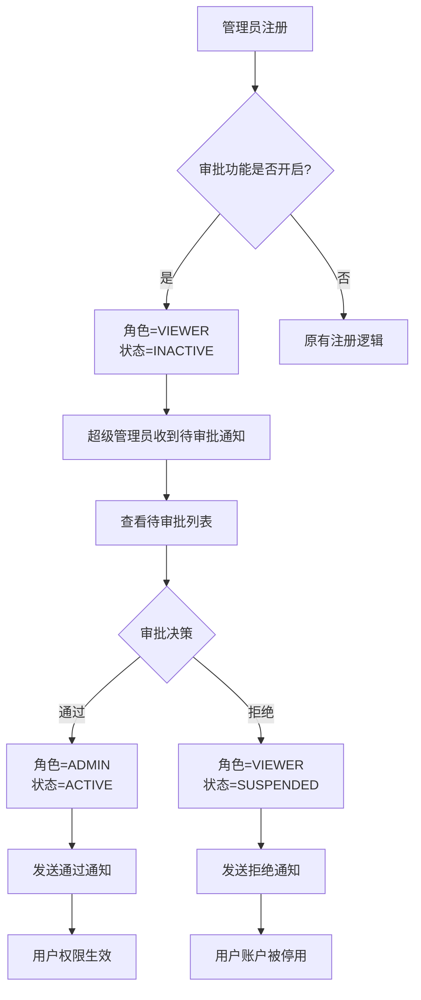
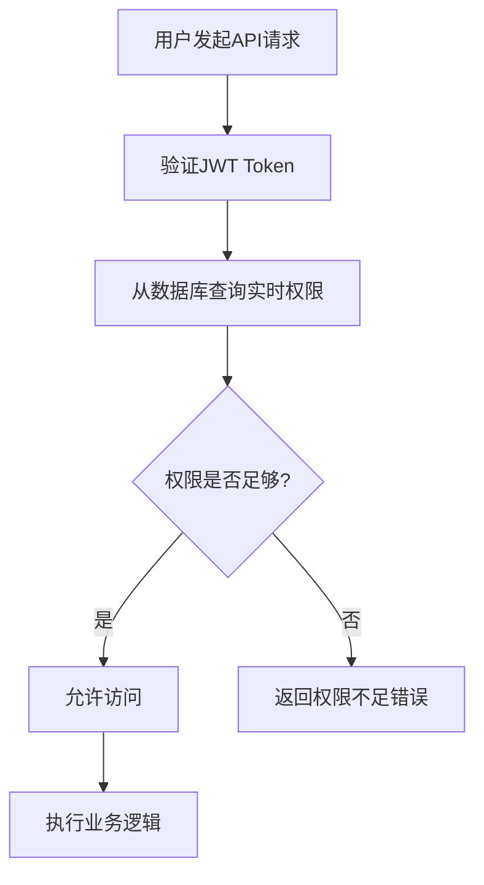

# 📋 管理员审批功能 API 文档

## 📖 概述

管理员审批功能允许超级管理员控制新注册管理员的权限提升。新注册的管理员默认为 `VIEWER` 角色且处于 `INACTIVE` 状态，需要超级管理员审批后才能获得完整权限。

### 🔧 功能特性

- ✅ **权限控制**：新用户默认只读权限，需审批后提升
- ✅ **实时生效**：权限变更立即生效，无需重新登录
- ✅ **操作审计**：完整的审批操作日志记录
- ✅ **灵活配置**：可通过环境变量开启/关闭审批功能
- ✅ **状态同步**：提供接口检查权限变更状态

### ⚙️ 配置选项

```bash
# 环境变量配置（.env 文件）
ADMIN_APPROVAL_ENABLED=true                      # 是否启用审批功能
ADMIN_DEFAULT_ROLE_PENDING_APPROVAL=viewer       # 待审批用户默认角色
ADMIN_DEFAULT_STATUS_PENDING_APPROVAL=inactive   # 待审批用户默认状态
```

---

## 🔗 API 接口

### 基础信息

- **Base URL**: `http://your-domain/api/v1/admin/approval`
- **认证方式**: Bearer Token (JWT)
- **数据格式**: JSON

---

## 1. 📋 获取待审批管理员列表

获取所有待审批的管理员账户列表。

### 请求信息

```http
GET /api/v1/admin/approval/pending
```

**权限要求**: `SUPER_ADMIN`

### 请求参数

| 参数名 | 类型 | 必填 | 默认值 | 说明 |
|--------|------|------|--------|------|
| page | int | 否 | 1 | 页码，从1开始 |
| page_size | int | 否 | 20 | 每页数量，最大100 |
| search | string | 否 | - | 搜索关键词，支持用户名和姓名模糊搜索 |

### 请求示例

```bash
curl -X GET "http://localhost:8001/api/v1/admin/approval/pending?page=1&page_size=10&search=zhang" \
  -H "Authorization: Bearer your_admin_token"
```

### 响应格式

```json
{
  "success": true,
  "message": "获取待审批列表成功",
  "data": {
    "total": 5,
    "items": [
      {
        "id": 123,
        "username": "zhang_san",
        "real_name": "张三",
        "email": "zhangsan@example.com",
        "phone": "138****1234",
        "role": "viewer",
        "status": "inactive",
        "created_at": "2025-10-21T10:30:00Z",
        "created_by": 1
      }
    ],
    "page": 1,
    "page_size": 10,
    "pages": 1
  }
}
```

### JavaScript 示例

```javascript
async function getPendingApprovals(page = 1, pageSize = 20, search = '') {
  const params = new URLSearchParams({
    page: page.toString(),
    page_size: pageSize.toString()
  });
  
  if (search) {
    params.append('search', search);
  }
  
  const response = await fetch(`/api/v1/admin/approval/pending?${params}`, {
    headers: {
      'Authorization': `Bearer ${localStorage.getItem('admin_token')}`,
      'Content-Type': 'application/json'
    }
  });
  
  return await response.json();
}
```

---

## 2. ✅ 审批管理员权限

对指定管理员进行审批操作（通过或拒绝）。

### 请求信息

```http
POST /api/v1/admin/approval/approve/{admin_id}
```

**权限要求**: `SUPER_ADMIN`

### 路径参数

| 参数名 | 类型 | 必填 | 说明 |
|--------|------|------|------|
| admin_id | int | 是 | 待审批管理员ID |

### 请求体

```json
{
  "action": "approve",        // 审批动作: "approve" | "reject"
  "target_role": "admin",     // 目标角色: "admin" | "viewer" (仅在通过时使用)
  "reason": "用户资质良好，通过审批"  // 审批理由 (可选)
}
```

### 请求参数说明

| 字段名 | 类型 | 必填 | 说明 |
|--------|------|------|------|
| action | string | 是 | 审批动作，`approve`(通过) 或 `reject`(拒绝) |
| target_role | string | 否 | 目标角色，默认为 `admin`，不能设置为 `super_admin` |
| reason | string | 否 | 审批理由，最大500字符 |

### 请求示例

```bash
# 通过审批
curl -X POST "http://localhost:8001/api/v1/admin/approval/approve/123" \
  -H "Authorization: Bearer your_admin_token" \
  -H "Content-Type: application/json" \
  -d '{
    "action": "approve",
    "target_role": "admin",
    "reason": "用户资质良好，通过审批"
  }'

# 拒绝审批
curl -X POST "http://localhost:8001/api/v1/admin/approval/approve/123" \
  -H "Authorization: Bearer your_admin_token" \
  -H "Content-Type: application/json" \
  -d '{
    "action": "reject",
    "reason": "用户资质不符合要求"
  }'
```

### 响应格式

```json
{
  "success": true,
  "message": "管理员 zhang_san 审批通过",
  "data": {
    "admin_id": 123,
    "action": "approve",
    "new_role": "admin",
    "new_status": "active",
    "reason": "用户资质良好，通过审批"
  }
}
```

### JavaScript 示例

```javascript
async function approveAdmin(adminId, action, targetRole = 'admin', reason = '') {
  const requestBody = {
    action,
    reason
  };
  
  if (action === 'approve') {
    requestBody.target_role = targetRole;
  }
  
  const response = await fetch(`/api/v1/admin/approval/approve/${adminId}`, {
    method: 'POST',
    headers: {
      'Authorization': `Bearer ${localStorage.getItem('admin_token')}`,
      'Content-Type': 'application/json'
    },
    body: JSON.stringify(requestBody)
  });
  
  return await response.json();
}

// 使用示例
await approveAdmin(123, 'approve', 'admin', '用户资质良好');
await approveAdmin(124, 'reject', null, '用户资质不符合要求');
```

---

## 3. 🔍 查看个人审批状态

检查当前用户的审批状态，用于前端判断权限是否有变化。

### 请求信息

```http
GET /api/v1/admin/approval/my-status
```

**权限要求**: 任何已登录的管理员

### 请求示例

```bash
curl -X GET "http://localhost:8001/api/v1/admin/approval/my-status" \
  -H "Authorization: Bearer your_admin_token"
```

### 响应格式

```json
{
  "success": true,
  "message": "获取审批状态成功",
  "data": {
    "admin_id": 123,
    "username": "zhang_san",
    "current_role": "admin",
    "previous_role": "viewer",
    "status": "active",
    "approval_info": {
      "is_approved": true,
      "approved_at": "2025-10-21T10:30:00Z",
      "approved_by": 1,
      "approval_reason": "用户资质良好，通过审批"
    },
    "permissions_changed": true,
    "need_token_refresh": true
  }
}
```

### 响应字段说明

| 字段名 | 类型 | 说明 |
|--------|------|------|
| permissions_changed | boolean | 权限是否有变化 |
| need_token_refresh | boolean | 是否建议刷新token |
| approval_info.is_approved | boolean | 是否已通过审批 |

### JavaScript 示例

```javascript
async function checkMyApprovalStatus() {
  const response = await fetch('/api/v1/admin/approval/my-status', {
    headers: {
      'Authorization': `Bearer ${localStorage.getItem('admin_token')}`
    }
  });
  
  const result = await response.json();
  
  // 如果权限有变化，建议刷新token
  if (result.data.need_token_refresh) {
    await refreshToken();
    // 显示权限提升通知
    showNotification('🎉 您的权限已提升为管理员');
  }
  
  return result;
}

// 定时检查状态（可选）
setInterval(checkMyApprovalStatus, 30000); // 每30秒检查一次
```

---

## 4. 📊 审批统计信息

获取审批相关的统计数据。

### 请求信息

```http
GET /api/v1/admin/approval/statistics
```

**权限要求**: `SUPER_ADMIN`

### 请求示例

```bash
curl -X GET "http://localhost:8001/api/v1/admin/approval/statistics" \
  -H "Authorization: Bearer your_admin_token"
```

### 响应格式

```json
{
  "success": true,
  "message": "获取审批统计成功",
  "data": {
    "pending_count": 5,      // 待审批数量
    "approved_today": 3,     // 今日通过数量
    "rejected_today": 1,     // 今日拒绝数量
    "total_registered": 10   // 今日注册总数
  }
}
```

### JavaScript 示例

```javascript
async function getApprovalStatistics() {
  const response = await fetch('/api/v1/admin/approval/statistics', {
    headers: {
      'Authorization': `Bearer ${localStorage.getItem('admin_token')}`
    }
  });
  
  return await response.json();
}
```

---

## 🔄 业务流程

### 注册审批流程



### 权限检查流程



---

## 🎨 前端集成指南

### 1. 审批管理页面

```javascript
// 审批管理组件示例
class ApprovalManager {
  constructor() {
    this.currentPage = 1;
    this.pageSize = 20;
    this.searchKeyword = '';
  }
  
  async loadPendingList() {
    try {
      const result = await getPendingApprovals(
        this.currentPage, 
        this.pageSize, 
        this.searchKeyword
      );
      
      if (result.success) {
        this.renderApprovalList(result.data.items);
        this.renderPagination(result.data);
      }
    } catch (error) {
      console.error('加载待审批列表失败:', error);
    }
  }
  
  async handleApproval(adminId, action, reason) {
    try {
      const result = await approveAdmin(adminId, action, 'admin', reason);
      
      if (result.success) {
        this.showSuccessMessage(result.message);
        await this.loadPendingList(); // 刷新列表
      }
    } catch (error) {
      console.error('审批操作失败:', error);
    }
  }
  
  renderApprovalList(items) {
    // 渲染待审批列表的UI代码
  }
}
```

### 2. 权限状态监控

```javascript
// 权限状态监控器
class PermissionMonitor {
  constructor() {
    this.checkInterval = 30000; // 30秒检查一次
    this.isMonitoring = false;
  }
  
  startMonitoring() {
    this.isMonitoring = true;
    this.checkPermissionStatus();
    
    setInterval(() => {
      if (this.isMonitoring) {
        this.checkPermissionStatus();
      }
    }, this.checkInterval);
  }
  
  async checkPermissionStatus() {
    try {
      const result = await checkMyApprovalStatus();
      
      if (result.data.permissions_changed) {
        await this.handlePermissionChange(result.data);
      }
    } catch (error) {
      console.error('检查权限状态失败:', error);
    }
  }
  
  async handlePermissionChange(statusData) {
    // 刷新token
    if (statusData.need_token_refresh) {
      await this.refreshUserToken();
    }
    
    // 显示通知
    this.showPermissionChangeNotification(statusData);
    
    // 更新UI权限状态
    this.updateUIPermissions(statusData.current_role);
    
    // 重定向到相应页面
    if (statusData.current_role === 'admin') {
      this.redirectToAdminDashboard();
    }
  }
  
  showPermissionChangeNotification(data) {
    const message = data.approval_info.is_approved 
      ? `🎉 恭喜！您的权限已从 ${data.previous_role} 提升为 ${data.current_role}`
      : `❌ 很抱歉，您的审批申请被拒绝`;
      
    // 使用你的通知组件显示消息
    this.showNotification(message, data.approval_info.is_approved ? 'success' : 'error');
  }
}
```

### 3. Vue.js 组件示例

```vue
<template>
  <div class="approval-manager">
    <!-- 搜索栏 -->
    <div class="search-bar">
      <input 
        v-model="searchKeyword" 
        @input="handleSearch"
        placeholder="搜索用户名或姓名"
        class="search-input"
      />
    </div>
    
    <!-- 待审批列表 -->
    <div class="approval-list">
      <div 
        v-for="admin in pendingList" 
        :key="admin.id"
        class="approval-item"
      >
        <div class="admin-info">
          <h3>{{ admin.real_name || admin.username }}</h3>
          <p>用户名: {{ admin.username }}</p>
          <p>邮箱: {{ admin.email }}</p>
          <p>注册时间: {{ formatDate(admin.created_at) }}</p>
        </div>
        
        <div class="approval-actions">
          <button 
            @click="handleApprove(admin.id)"
            class="btn-approve"
          >
            通过
          </button>
          <button 
            @click="handleReject(admin.id)"
            class="btn-reject"
          >
            拒绝
          </button>
        </div>
      </div>
    </div>
    
    <!-- 分页 -->
    <div class="pagination">
      <!-- 分页组件 -->
    </div>
  </div>
</template>

<script>
export default {
  name: 'ApprovalManager',
  data() {
    return {
      pendingList: [],
      searchKeyword: '',
      currentPage: 1,
      pageSize: 20,
      totalPages: 0
    };
  },
  
  async mounted() {
    await this.loadPendingList();
  },
  
  methods: {
    async loadPendingList() {
      try {
        const result = await getPendingApprovals(
          this.currentPage,
          this.pageSize,
          this.searchKeyword
        );
        
        if (result.success) {
          this.pendingList = result.data.items;
          this.totalPages = result.data.pages;
        }
      } catch (error) {
        this.$message.error('加载失败');
      }
    },
    
    async handleApprove(adminId) {
      const reason = await this.promptForReason('请输入审批通过的理由');
      if (reason !== null) {
        await this.performApproval(adminId, 'approve', reason);
      }
    },
    
    async handleReject(adminId) {
      const reason = await this.promptForReason('请输入审批拒绝的理由');
      if (reason !== null) {
        await this.performApproval(adminId, 'reject', reason);
      }
    },
    
    async performApproval(adminId, action, reason) {
      try {
        const result = await approveAdmin(adminId, action, 'admin', reason);
        
        if (result.success) {
          this.$message.success(result.message);
          await this.loadPendingList();
        }
      } catch (error) {
        this.$message.error('审批操作失败');
      }
    }
  }
};
</script>
```

---

## ❌ 错误码说明

| HTTP状态码 | 错误码 | 说明 | 解决方案 |
|------------|---------|------|----------|
| 401 | UNAUTHORIZED | 未授权，token无效或过期 | 重新登录获取token |
| 403 | FORBIDDEN | 权限不足，需要SUPER_ADMIN权限 | 使用超级管理员账户 |
| 404 | NOT_FOUND | 目标管理员不存在 | 检查admin_id是否正确 |
| 400 | BAD_REQUEST | 请求参数错误 | 检查请求参数格式和值 |
| 400 | INVALID_STATUS | 管理员不在待审批状态 | 确认管理员状态 |
| 400 | CANNOT_APPROVE_SELF | 不能审批自己的账户 | 使用其他超级管理员账户 |

### 错误响应格式

```json
{
  "success": false,
  "message": "错误描述",
  "detail": "详细错误信息"
}
```

---

## 🔧 配置和部署

### 环境变量配置

```bash
# .env 文件
ADMIN_APPROVAL_ENABLED=true
ADMIN_DEFAULT_ROLE_PENDING_APPROVAL=viewer
ADMIN_DEFAULT_STATUS_PENDING_APPROVAL=inactive
```

### 数据库要求

审批功能使用现有的数据库表结构，无需额外的数据库迁移：

- `admin_users` - 管理员用户表
- `admin_operation_logs` - 操作日志表

### 权限要求

- 只有 `SUPER_ADMIN` 角色可以执行审批操作
- 所有已登录管理员都可以查看自己的审批状态

---

## 🎯 最佳实践

### 1. 安全建议

- 定期检查待审批列表，及时处理申请
- 审批时填写详细的理由，便于审计
- 不要在生产环境中关闭审批功能

### 2. 用户体验

- 前端实现权限状态的自动检查和更新
- 权限变更时给用户明确的提示
- 提供清晰的审批状态说明

### 3. 监控和日志

- 监控待审批数量，防止积压
- 关注审批操作的日志记录
- 定期分析审批通过率和拒绝原因

---

## 📞 技术支持

如有问题，请联系开发团队或查看操作日志获取详细错误信息。

**文档版本**: v1.0  
**更新时间**: 2025-10-21  
**适用版本**: API v1.0+
